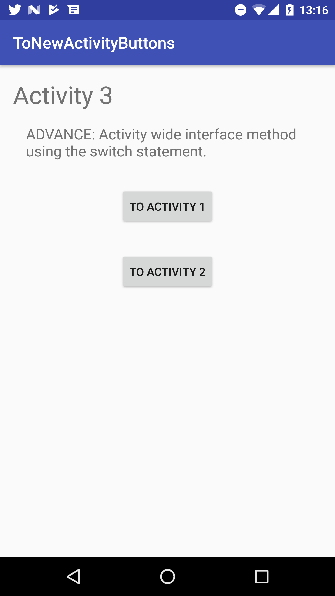

# ToNewActivityButtons
App shows 3 different ways for handling onClick events who's intents start a new activity. It includes multiple buttons per activity to demonstrate the advantages of one method over another.

Android Studio 2.2.2 APK 25

There are 3 different ways to start a new activity in Android, and they all use the `Intent` class; [Intent | Android Developers][1]. 

 1. Using the `onClick` attribute of the Button. (Beginner)
 2. Assigning an `OnClickListener()` via an anonymous class. (Intermediate) 
 3. Activity wide interface method using the `switch` statement. (Pro)

### 1. Using the `onClick` attribute of the Button. (Beginner)

Buttons have an `onClick` attribute that is found within the .xml file: 

    <Button
        android:id="@+id/button1"
        android:layout_width="wrap_content"
        android:layout_height="wrap_content"
        android:onClick="goToAnActivity"
        android:text="to an activity" />

    <Button
        android:id="@+id/button2"
        android:layout_width="wrap_content"
        android:layout_height="wrap_content"
        android:onClick="goToAnotherActivity"
        android:text="to another activity" />

In Java class:

    @Override
    protected void onCreate(Bundle savedInstanceState) {
        super.onCreate(savedInstanceState);
        setContentView(R.layout.main_activity);
    }

    public void goToAnActivity(View view) {
        Intent Intent = new Intent(this, AnActivity.class);
        startActivity(Intent);
    }

    public void goToAnotherActivity(View view) {
        Intent Intent = new Intent(this, AnotherActivity.class);
        startActivity(Intent);
    }
 
Advantage: Easy to make on the fly, modular, and can easily set multiple onClicks to the same intent easily. 

Disadvantage: Difficult readability when reviewing.

###  2. Assigning an `OnClickListener()` via an anonymous class. (Intermediate) 

This is when you set a separate `setOnClickListener()` to each `button` and override each `onClick()` with its own intent.    

In Java class: 

    @Override
    protected void onCreate(Bundle savedInstanceState) {
            super.onCreate(savedInstanceState);
            setContentView(R.layout.main_activity);
    
            button1 = (Button) findViewById(R.id.button1);
            button1.setOnClickListener(new View.OnClickListener() {
                @Override
                public void onClick(View view) {
                    Intent Intent = new Intent(view.getContext(), AnActivity.class);
                    view.getContext().startActivity(Intent);}
                });
    
            button2 = (Button) findViewById(R.id.button2);
            button2.setOnClickListener(new View.OnClickListener() {
                @Override
                public void onClick(View view) {
                    Intent Intent = new Intent(view.getContext(), AnotherActivity.class);
                    view.getContext().startActivity(Intent);}
                });

Advantage: Easy to make on the fly. 

Disadvantage: there will be a lot of anonymous classes which will make readability difficult when reviewing.

###  3. Activity wide interface method using the `switch` statement. (Pro)

This is when you use a `switch` statement for your buttons within the `onClick()` method to manage all the Activity's buttons. 

In Java class:

    @Override
    protected void onCreate(Bundle savedInstanceState) {
        super.onCreate(savedInstanceState);
        setContentView(R.layout.main_activity);
    
        button1 = (Button) findViewById(R.id.button1);
        button2 = (Button) findViewById(R.id.button2);
        button1.setOnClickListener(this);
        button2.setOnClickListener(this);
    }
    
    @Override
    public void onClick(View view) {
        switch (view.getId()){
            case R.id.button1:
                Intent intent1 = new Intent(this, AnActivity.class);
                startActivity(intent1);
                break;
            case R.id.button2:
                Intent intent2 = new Intent(this, AnotherActivity.class);
                startActivity(intent2);
                break;
            default:
                break;
        }

Advantage: Easy button management because all button intents are registered in a single `onClick()` method

----------

  [1]: https://developer.android.com/reference/android/content/Intent.html
  [2]: https://github.com/martinsing/ToNewActivityButtons
  [3]: https://stackoverflow.com/questions/2091465/how-do-i-pass-data-between-activities-on-android

## Screenshots
  